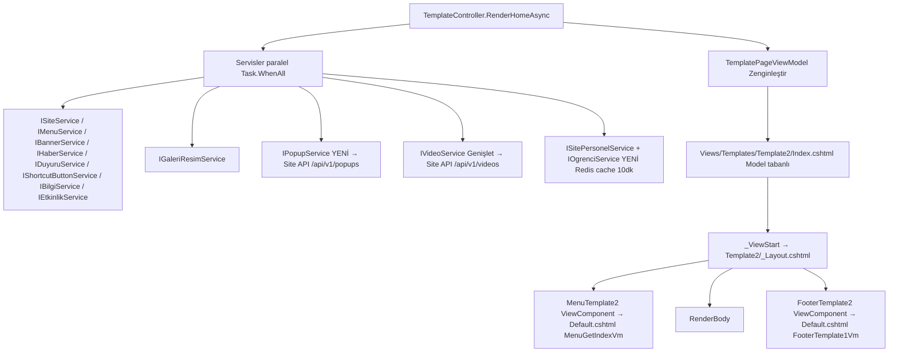

# Template2 Dinamikleştirme Planı

## Hedef
`Microservice.Web/Views/Templates/Template2/Index.cshtml` sayfasını, Template1/Index gibi **Model (TemplatePageViewModel) tabanlı** hale getirmek; HTML yapısını korumak; `MenuTemplate2` ve `FooterTemplate2` View Component'lerini gerçek verilerle çalışır hale getirmek ve `Template2/_Layout.cshtml`'i düzeltmek.

## Mevcut Sorunlar
1. `Template2/Index.cshtml`: `ViewBag.*`, `DAL.Etkinlik`, `Popup`, `BilgiPanosu`, `SiteGaleri`, `DilTuru` (eski monolith `AnaWebsite` kalıntıları) kullanıyor; layout olarak olmayan `~/Views/Shared/{ViewBag.TemplateName}/_WebMainLayout.cshtml`'i işaret ediyor. `Layout` set edildiği için `Template2/_ViewStart.cshtml` devre dışı kalıyor.
2. `Views/Shared/Components/MenuTemplate2/Default.cshtml` ve `FooterTemplate2/Default.cshtml`: `@using AnaWebsite.Utility` + `ViewBag` — **derleme hataları** (CS0246 x4). Component sınıfları zaten `MenuGetIndexVm` / `FooterTemplate1Vm` üretiyor; sadece view'lar eski.
3. `Template2/_Layout.cshtml`: `<head>` `~/template2/...` (doğru), `<body>` script'leri `~/assets/@ViewBag.TemplateName/...` (yanlış, ViewBag null).
4. Controller `RenderHomeAsync` zaten `TemplatePageViewModel`'i dolduruyor ama Template2'nin ihtiyaç duyduğu ek veriler yok: Popup, Videolar, GaleriResimler, BandLogolar, sayaçlar.

## Kararlar (kullanıcı onaylı)
- **İlan Panosu** bölümü → `Bilgiler` içerik tipiyle beslenecek (aynı kart yapısı korunur).
- **Counter** bölümü → `SitePersonel` (İdari/Akademik) + Ogrenci API; Web tarafında **Redis ile 10 dk cache**. Mezun = `Durum` "mezun" içeren kayıt sayısı.

## Mimari Akış

## Yapılacaklar

### 1. Servis katmanı (Microservice.Web)
- [ ] `Clients/PopupClients/IPopupClientServices.cs` — `GET /api/v1/popups?siteId=&dilId=` (Refit). 404 → "popup yok" sayılır.
- [ ] `ViewModels/Popup/GetPopupVm.cs` — `Id, Baslik, Link, ResimUrl, TamEkranMi, GosterimSuresiSaniye, CookieIleTekrarGosterme`.
- [ ] `Services/Interfaces/IPopupService.cs` + `Services/PopupService.cs` — `ServiceResult<GetPopupVm?> GetPopupAsync(siteId, dilId)`.
- [ ] `Clients/OgrenciClients/IOgrenciClientServices.cs` — `GET /api/v1/ogrencis` (Ogrenci microservice base URL, `Microservices:Ogrenci:BaseUrl`).
- [ ] `ViewModels/Ogrenci/OgrenciListItemVm.cs` — yalnız `Durum` + `MezuniyetTarihi` (listeyi hafif tutmak için).
- [ ] `Services/Interfaces/IOgrenciService.cs` + `Services/OgrenciService.cs` — `Task<int> GetAktifOgrenciSayisiAsync()` / `GetMezunOgrenciSayisiAsync()`; Redis 10 dk cache (`IRedisCacheService` mevcut).
- [ ] `IVideoService` → `GetVideolarAsync(siteId, dilId)` ekle (`VideoService` + Refit client'ta `GET /api/v1/videos` zaten var: `GetVideolarAsync`).
- [ ] `ClientExtentions.cs`: Popup + Ogrenci Refit client kayıtları (Ogrenci base address ayrı). `ServicesExtention.cs`: `IPopupService`, `IOgrenciService` DI.

### 2. Controller (`TemplateController.RenderHomeAsync`)
- [ ] `TemplatePageViewModel`'e ekle: `Popup`, `Videolar`, `VideoListUrl`, `GaleriResimler`, `GaleriListUrl`, `BandLogolar`, `OgrenciSayisi`, `IdariPersonelSayisi`, `AkademikPersonelSayisi`, `MezunOgrenciSayisi`.
- [ ] Paralel fetch'e ekle: popup, videolar, galeri resimleri, bandLogolar, personel listesi (sayılar), ogrenci sayıları (cache'li servis).
- [ ] Sayfa tipleri: `VideoListesi` ve `GaleriResimListesi` PageType slug'larından liste URL'leri üret (Haber/Duyuru pattern'i).
- [ ] `ViewData["SiteId"]`, `ViewData["DilId"]`, `ViewData["LanguageCode"]`, `ViewData["Menus"]`, `ViewData["Site"]` zaten layout/components için set ediliyor — koru.
- [ ] Sayaçlar: `GetPersonelListAsync(siteId)` içinde `PersonelTipAd == "İdari"/"Akademik"` sayımı (kültür bağımsız OrdinalIgnoreCase).

### 3. Layout (`Template2/_Layout.cshtml`)
- [ ] Script yollarını `~/assets/@ViewBag.TemplateName/...` → `~/template2/...` yap (js, bootstrap, owlcarousel, scripts.js).
- [ ] Head'de `jquery` yok; counter/owl/magnific popup script zincirini head'den değil body'den yükle (mevcut sırada sadece yol düzeltmesi yeter).

### 4. MenuTemplate2 View (`Components/MenuTemplate2/Default.cshtml`)
- [ ] `@model MenuGetIndexVm`; `AnaWebsite`/`ViewBag`/`DilTuru` tamamen kalkar.
- [ ] Hard-coded "Mega Menu" demo `<li>` bloğu silinir; Template1'deki recursive menu rendering deseni `GetMenuVm`/`Children` üzerine kurulur (dropdown + dropdown-mega-menu sınıfları korunur).
- [ ] Link üretimi: `menu.Link` doluysa doğrudan, değilse `/{LanguageCode}/{PageType.Slug}/{menu.SeoUrl}` (Template1 BuildHref deseni).
- [ ] Topbar: `Site.SiteEPosta`, `Site.SiteOzellikleri` (tel/whatsapp/social), `LanguageCode == "en"` ise TR'ye geçiş `href="/tr"` aksi `href="/en"`; bayrak görselleri `~/template2/images/flags/...`.
- [ ] Navbar brand: `SiteOzellikleri.SiteTopbarLogo` varsa onu kullan, yoksa `~/template2/images/logo_dark.png` fallback.
- [ ] Arama formu: `action="/{LanguageCode}/{SearchPageSlug}"`, input `name="q"`.

### 5. FooterTemplate2 View (`Components/FooterTemplate2/Default.cshtml`)
- [ ] `@model FooterTemplate1Vm`.
- [ ] Footer logosu: `SiteOzellikleri.SiteFooterLogo` yoksa `~/template2/images/tetra_footer.png` fallback.
- [ ] İletişim: `Site.SiteEPosta`, `SiteOzellikleri.SiteTelNo/SiteFaxNo/SiteAdress(Eng)`.
- [ ] Social ikonlar: `SiteOzellikleri` alanlarından; boş olanlar render edilmez.
- [ ] Sütunlar: `FooterColumns` (Location=Footer kok menüler + children, `BuildHref` ile).
- [ ] Harita: `SiteOzellikleri.SiteHaritaAdress` iframe.
- [ ] Copyright: `DateTime.Now.Year` + site adı.

### 6. Index.cshtml (HTML yapısı aynı kalacak)
- [ ] Model = `TemplatePageViewModel`; tüm `ViewBag.*` → `Model.*`.
- [ ] Dil karşılaştırmaları: `ViewBag.dilObj.id == DilTuru.Ingilizce` → `Model.LanguageCode == "en"` (veya helper local function `T(tr, en)`).
- [ ] Popup modal: `Model.Popup` (link + resim + çerez tekrar-göstermeme JS'i, cookie 1 gün).
- [ ] Marquee: `Model.Duyurular` → `BuildContentHref(duyuru.Link, SeoUrl, PageType.Slug)`.
- [ ] Banner carousel: `Model.Banners` (resim + başlık + kısa açıklama; href için `PageType.Slug`/`SeoUrl` yoksa `#`).
- [ ] Hızlı erişim: `Model.ShortcutButtons` (`IsIconImage` → `ImageUrl`, değilse `IconUrl` sınıfı; `Link`).
- [ ] Duyurular: `Model.Duyurular` ikiye bölünür (sol/sağ) — eski `solDuyuruList`/`sagDuyuruList` görünümü; "Tüm Duyurular" → `Model.DuyuruListUrl`.
- [ ] İlan Panosu: `Model.Bilgiler` (kart: resim/başlık/kısa açıklama; tarih varsa göster, `BuildContentHref`).
- [ ] Haberler: `Model.Haberler`; "Tüm Haberler" → `Model.HaberListUrl`.
- [ ] Sosyal Medya: `Model.Site.SiteOzellikleri.SiteFacebookAdress` / `SiteInstagramAdress` varsa render et (Template1 deseni), adresler boşsa bölüm atlanır.
- [ ] Yaklaşan Etkinlikler: `Model.Etkinlikler` (ilk büyük kart + kalanları liste; tarih = `YayimTarihi`).
- [ ] Hakkımızda + sayaç: `SiteOzellikleri.SiteBaslangicHakkimizda(Eng)`; Personel = İdari+Akademik sayıları, Öğrenci = `OgrenciSayisi`. Video: `SiteBaslangicVideoLink/Resim`.
- [ ] Tanıtım Videoları: `Model.Videolar`; "Tüm Videolar" → `Model.VideoListUrl`.
- [ ] Counter bölümü: 4 kutu = `OgrenciSayisi`, `IdariPersonelSayisi`, `AkademikPersonelSayisi`, `MezunOgrenciSayisi` (`counter_icon*.png` yolları `~/template2/images/...`).
- [ ] Galeri: `Model.GaleriResimler` — kategori çubuğu = distinct `Kategori`; kartlar `ResimUrl`; popup büyük resim = aynı `ResimUrl`; `data-filter` sınıfı `kategori-{index}` gibi güvenli slug (eski `css_sinif` yerine). "Tüm Galeri" → `Model.GaleriListUrl`.
- [ ] Gezinti videosu: `SiteBaslangicVideoLink` varsa render; `data-parallax-bg-image` yolu `~/template2/images/...`.
- [ ] Bağlantılar (logoObj): `Model.BandLogolar` (`ImgUrl`, `Link`).
- [ ] Sayfa sonu `scrollup` linki korunur; `@section Scripts` popup cookie JS'i.

### 7. Doğrulama
- [ ] `dotnet build Microservice.Web/Microservice.Web.csproj` → 0 hata (özellikle 4 CS0246 gider).
- [ ] Razor'ın tip güvenli derlendiğini teyit için build yeterli; runtime'da Template2 bir site (`TemplateId=2`) ile smoke test: menü/footer/index render.

## Notlar / Kapsam Dışı
- Eski `BilgiPanosu`, `SiteGaleri` (çoklu resim carousel), `BannerYaziYon`, `Hedef.tur` entity'leri yeni sistemde yok; karşılıkları sırasıyla `Bilgi`, `GaleriResim`, `Banner`, `HedefId` ile eşlenir. Carousel galeri kartları tek resme indirgenir (HTML yapısı korunur).
- `Etkinlik` detay alanları (`location`, `start_time`) yeni `GetEtkinlikVm`'de yok; kartta `KisaAciklama` + tarih kullanılır.
- Diğer Template2 sayfaları (Duyuru, Haber, Personel vb.) zaten model tabanlı ve çalışıyor; bu plan yalnız Index + Layout + 2 component view'ını kapsar.
